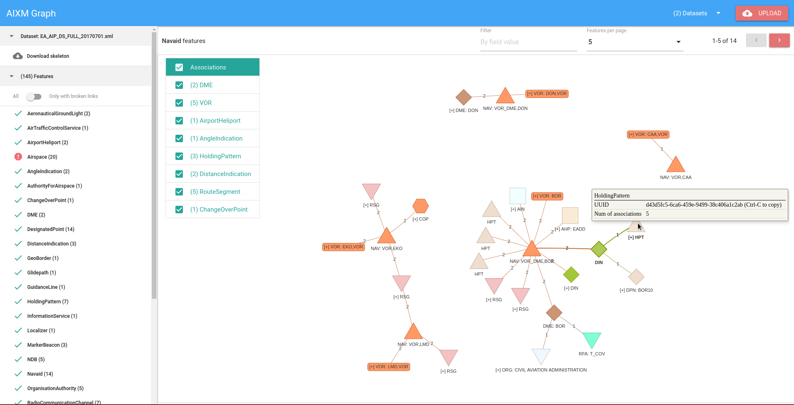

# AIXM Graph v1.0
> Visualizing AIXM feature associations

AIXM Graph is a tool that aims at visualizing the various features found in an [AIXM](http://aixm.aero/) dataset along 
with their associations. The representation is made via an interactive graph where the user can explore the features
and how they connect to each other in the specific file. 

At this [link](https://aixm-graph.herokuapp.com/#!) you can have a look at a partial (no upload functionality) demo of 
the tool and play around with two preloaded AIXM datasets.

## Installing / Getting started

The project can get easily up and running in any machine regardless the running OS with the help of 
[Docker](https://www.docker.com/).

> Before proceeding to the next steps please make sure that you have installed on your machine:
> - Linux/Mac users
>     - [Git](https://git-scm.com/book/en/v2/Getting-Started-Installing-Git) 
>     - [Docker](https://docs.docker.com/get-docker/)
>         - Linux users will also need to have a look on some 
>           [post-installation actions](https://docs.docker.com/engine/install/linux-postinstall/):  
> - Windows users
>     - [Docker Toolbox on Windows](https://docs.docker.com/toolbox/toolbox_install_windows/) (which installs all the
>   required tools and runs the Docker Engine via VirtualBox)

Steps:

Get the repository
```shell script
git clone git@github.com:eurocontrol-swim/aixm-graph.git
cd aixm-graph
```

Build the image
```shell script
docker build -t aixm-graph:latest .
```

Run the container
```shell script
docker run -d --name aixm_graph -e "PORT=8765" -p 3000:8765 aixm-graph:latest
```

After the steps are successfully completed the project will be available at 
[http://localhost:3000](http://localhost:3000) 


## Developing

In order to run the project locally on your machine for development reasons you can start the server 
and the client separately.

### Server
> First make sure that [python](https://www.python.org/downloads/) and 
>[conda](https://docs.conda.io/projects/conda/en/latest/user-guide/install/) are installed on your system.

Create a dedicated environment using conda
```shell script
cd server
conda env -create --name aixm-graph -f requirements.yml
```

activate the environment
```shell script
source activate aixm-graph
```

install the server package in your env
```shell script
pip install . 
```

run the local server
```shell script
python ./aixm_graph/app.py
```

The server should be able to receive calls at http://localhost:5000

### Client
> Make sure you have [npm](https://www.npmjs.com/get-npm) installed on your system

First install the dependencies
```shell script
cd client
npm install
```

and then run the client locally
```shell script
npm run serve
```

The client should be available at [http://localhost:8080](http://localhost:8080)


### Deploying / Publishing
Since the project is packaged with docker there are many options of easily deploying it in the cloud. On of them is 
[Heroku](https://heroku.com) and below you can find the steps about how to achieve this with the 
[Container Registry & Runtime](https://devcenter.heroku.com/articles/container-registry-and-runtime) method:

> Make sure you have the [Heroku CLI](https://devcenter.heroku.com/articles/heroku-cli) installed on you system

First create a heroku app
```shell script
cd aixm-graph
heroku create <app-name>
```

Login to the Heroku Container Registry:
```shell script
heroku container:login
```

> Make sure to replace <app-name> in the below comands with the name of the Heroku app that you just created.

Build the image and tag it with the following format:
```shell script
docker build -t registry.heroku.com/<app-name>/web
```

Push the image to the registry:
```shell script
docker push registry.heroku.com/<app-name>/web
```

Release the image:
```shell script
heroku container:release --app <app-name> web
```


## Features and usage
In the following sections you can find a detailed description of the available features of the AIXM Graph tool as well as
instructions about how to interact with it. 




### Upload and process AIXM dataset
A new dataset can be uploaded to the server by clicking the `Upload` button at the top-right corner. 
As soon as the dataset is uploaded a pre-processing will take place including:
#### XML Parsing 
Each `xml` element/feature is parsed and stored along with it's preconfigured key fields in memory

#### Creation of bi-directional associations
Typically, a feature holds references (`xlink:href`) to other features it's associated with. However, this association 
has one direction in a typical AIXM dataset. In order to facilitate the creation of the graph and illustrate better the 
associations among the features we generate bi-directional connections on all of them. In other words, a feature will 
keep in memory references for all the other features that keep a reference to it.

> Keep in mind that the uploading and the processing of the dataset depends heavily on its size. Although the procedure
> has been optimized and the whole processing/storing happens in memory, the final memory footprint equals more or less 
> the original size of the dataset. Thus, it has to be taken into consideration when attempting to upload/process a 
> dataset on a machine with limited resources. 

### Filter features with broken links  


## Contributing

If you'd like to contribute, please fork the repository and use a feature
branch. Pull requests are warmly welcome.


## Links

- Project homepage: https://your.github.com/awesome-project/
- Repository: https://github.com/your/awesome-project/
- Issue tracker: https://github.com/your/awesome-project/issues
  - In case of sensitive bugs like security vulnerabilities, please contact
    my@email.com directly instead of using issue tracker. We value your effort
    to improve the security and privacy of this project!
- Related projects:
  - Your other project: https://github.com/your/other-project/
  - Someone else's project: https://github.com/someones/awesome-project/


## Licensing

See LICENSE
